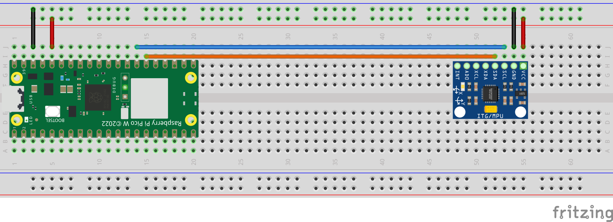
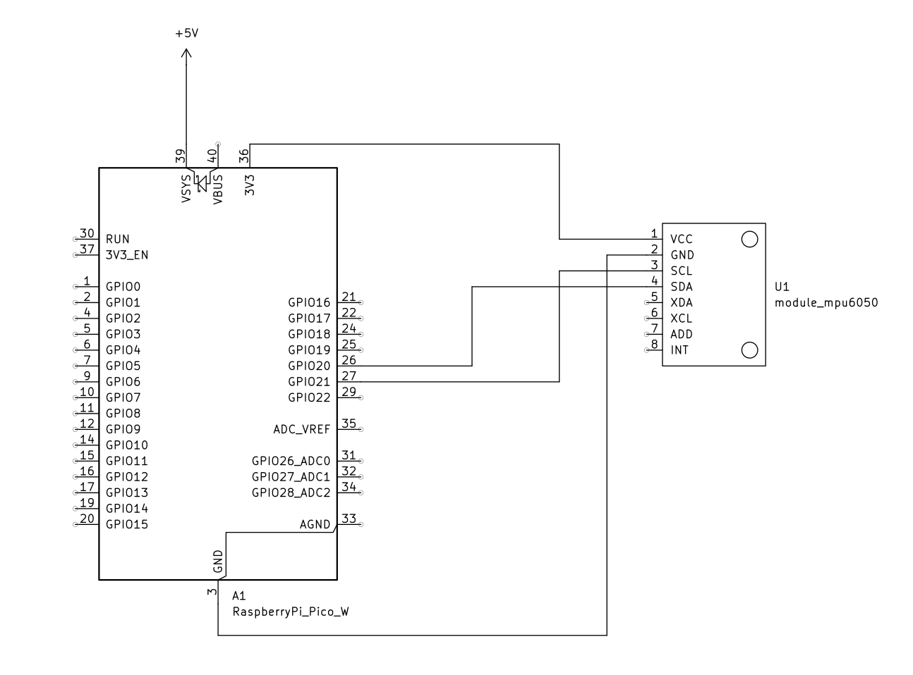

# Gesture-Car

Gesture-Car is a two-part wireless system that allows remote control of a car using hand gestures.

---

## Overview

The project consists of:

- **`car/`** — Source code for the car, written in C++ for the ESP32 using the Arduino framework via PlatformIO
- **`hand/`** — Source code for the gesture-sensing hand controller, written in MicroPython for the Raspberry Pi Pico W
- **`schematics/`** — Circuit schematics created using KiCad
- **`assets/`** — Electronics routing diagrams made with Fritzing and KiCad

---

## How It Works

The hand controller uses an **MPU6050** accelerometer and gyroscope to detect hand movements.
These gestures are interpreted and sent over Wi-Fi to the car, which then responds by moving in the corresponding direction.

The ESP32 on the car side receives commands and drives the motors accordingly.

---
## Electronics Wiring Diagrams

#### Hand Controller (Pico W + MPU6050)

Fritzing:

Kicad:

#### Car (ESP32 + Motor Driver)

Todo
